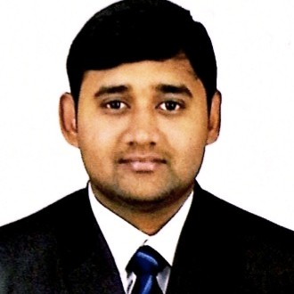

## 👋 Hi, I'm Dayanand

AI/ML Engineer building intelligent systems with LLMs, RAG, and real-world impact.

---

-   :material-account-circle: ***About Me***

    - 🧑‍💻 ML Engineer at Optum  
    - 🎓 PG Diploma in Data Science, IIIT-Bangalore  
    - 🎓 M.Tech in CSE, KL University  
    - 🔥 Exploring AI Research and Engineering 

-   

---

[📄 Download Resume](assets/Dayanand_Resume.pdf){ .md-button .md-button--primary }

[🔗 GitHub](https://github.com/dayanandcortex){ .md-button }

[💼 LinkedIn](https://www.linkedin.com/in/dayanandsagarkukkala){ .md-button }